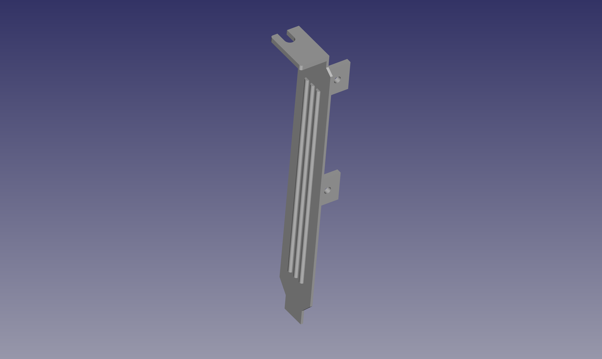

This is a standard bracket designed for the Commodore A2620 and A2630 coprocessor cards. This can be used to mount the A26x0 coprocessor card in a standard slot bracket for the Amiga 2000 EATX. Specifically, I designed it using the A2630 Rev 9 as a reference. As far as I know, it should work on either model and any revision.

